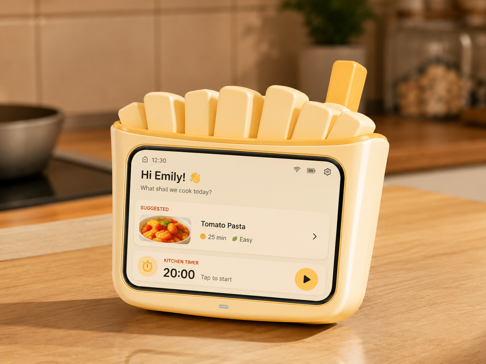

# 🍟 Fresh Mate Fries Case · 薯条造型外壳

[English](README_EN.md) · [Fresh Mate 主软件仓库][main-repo]



这是为 Fresh Mate 软硬一体版设计的可 3D 打印薯条造型外壳，目标开发板为 ESP32-S31-Korvo-1。软件、后端和固件不在本仓库，请前往主软件仓库下载。

## 🧩 兼容性

- 目标开发板：ESP32-S31-Korvo-1。
- 目标屏幕：该开发板配套的 800×480 LCD。
- 其他开发板、屏幕、扬声器或摄像头组合尚未验证。
- 打印前请根据自己的板卡版本核对接口位置和实际尺寸。

## 📦 文件说明

| 文件 | 用途 |
|---|---|
| `models/freshmate-fries-front.stl` | 前壳打印文件 |
| `models/freshmate-fries-back.stl` | 后壳打印文件 |
| `models/freshmate-fries-accent.stl` | 薯条/强调色独立部件 |
| `models/freshmate-fries-case.3mf` | 组合打印工程 |
| `source/freshmate-fries-case.blend` | Blender 可编辑源文件 |

## 🖨️ 打印前准备

需要切片软件、可打印 STL/3MF 的 FDM 或兼容打印机，以及适合设备外壳的耗材。

当前公开版本尚未完成跨打印机参数验证，因此以下内容暂不提供固定数值：

- 喷嘴直径：`TBD — 待实测`
- 层高：`TBD — 待实测`
- 壁厚和填充率：`TBD — 待实测`
- 支撑与摆放方向：`TBD — 待实测`
- 装配公差：`TBD — 待实测`
- 推荐耗材与热参数：`TBD — 待实测`

建议先在切片软件中检查模型尺寸、薄壁、悬垂和接口开口，再决定打印方向与支撑。

## 🧱 建议装配流程

1. 打印前壳、后壳和强调色部件，并清理支撑与毛边。
2. 不通电试装 ESP32-S31-Korvo-1，确认 USB、扬声器、麦克风和按键没有被遮挡。
3. 将开发板与屏幕放入后壳，检查线材和散热空间。
4. 试装前壳与强调色部件，确认没有挤压屏幕或连接器。
5. 确认固定方式和公差合适后再完成装配并通电测试。

具体螺丝、卡扣和粘接方案尚待实物验证，不建议在验证前强行压合。

## ✏️ 修改源文件

使用 Blender 打开：

```text
source/freshmate-fries-case.blend
```

发布修改版时，请保留 Fresh Mate 原始署名、说明改动内容，并遵守非商业许可。

## 🔗 软件与固件

完整 PWA、后端、AI Provider 接口和 ESP32 固件位于：

**[Fresh Mate Open Source][main-repo]**

## 🤝 反馈

欢迎提交 Issue 分享实际打印机、耗材、层高、支撑方式、装配问题和成品照片。请勿上传包含家庭网络密码、设备密钥或其他个人信息的日志和照片。

## 📄 License

本仓库的原创模型使用 [Creative Commons Attribution-NonCommercial 4.0 International](LICENSE)（CC BY-NC 4.0）：允许署名分享与修改，不允许商业使用。

本许可不涵盖 ESP32-S31-Korvo-1 开发板、Espressif 商标或第三方硬件设计。Fresh Mate 软件主仓库使用独立的 Apache-2.0 许可。

[main-repo]: https://github.com/choul798188551-tech/freshmate-open-source
